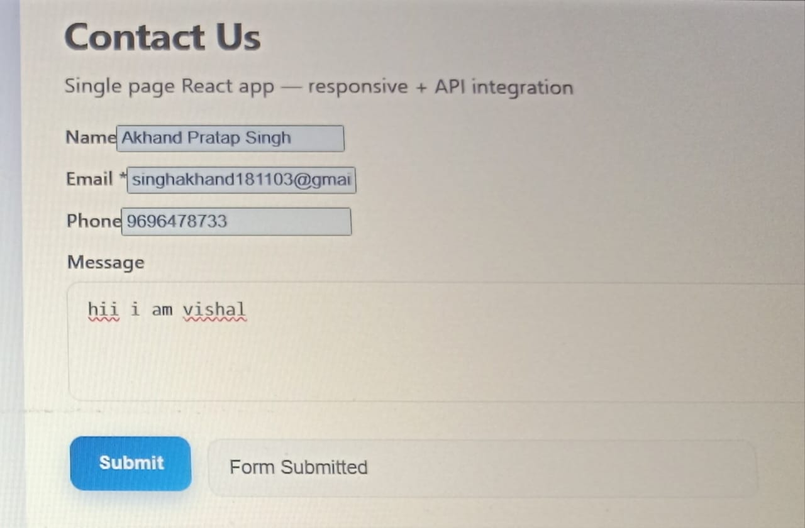
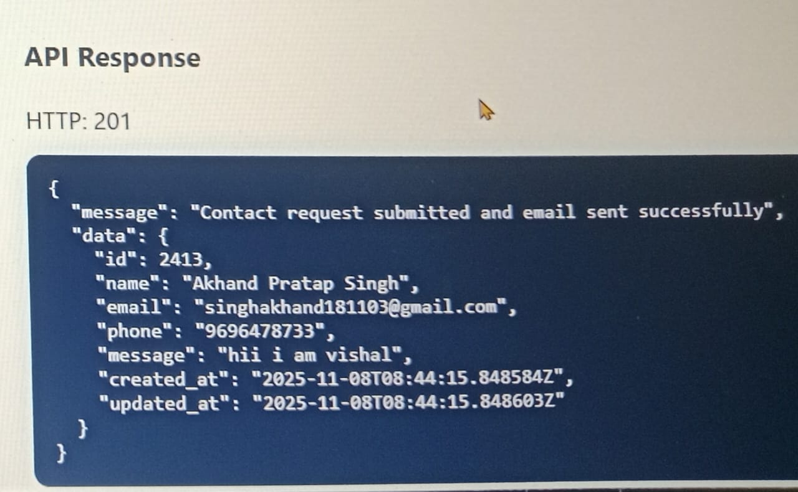

# Contact Form – React Single Page Application

A responsive single-page React application built as part of a Front-End Intern assessment.  
This app includes a contact form integrated with a backend API, form validation, and response handling.

---

## ✅ Features

- 📱 Fully responsive UI (Mobile, Tablet, Desktop)  
- ✅ Form validation (required fields + email validation)  
- 🔗 API Integration using **POST /contact-us**  
- ✉️ Displays API success message + formatted JSON response  
- ⚛️ Built using React (Functional Components + Hooks)

---

## 📸 Screenshots

### **1. Form View**

### **2. API Response View**

---

## 🚀 Tech Stack

- **ReactJS**
- **CSS / Responsive Design**
- **Fetch API / Axios**
- **JavaScript (ES6+)**

---

## 🔌 API Details

**Endpoint:**  
